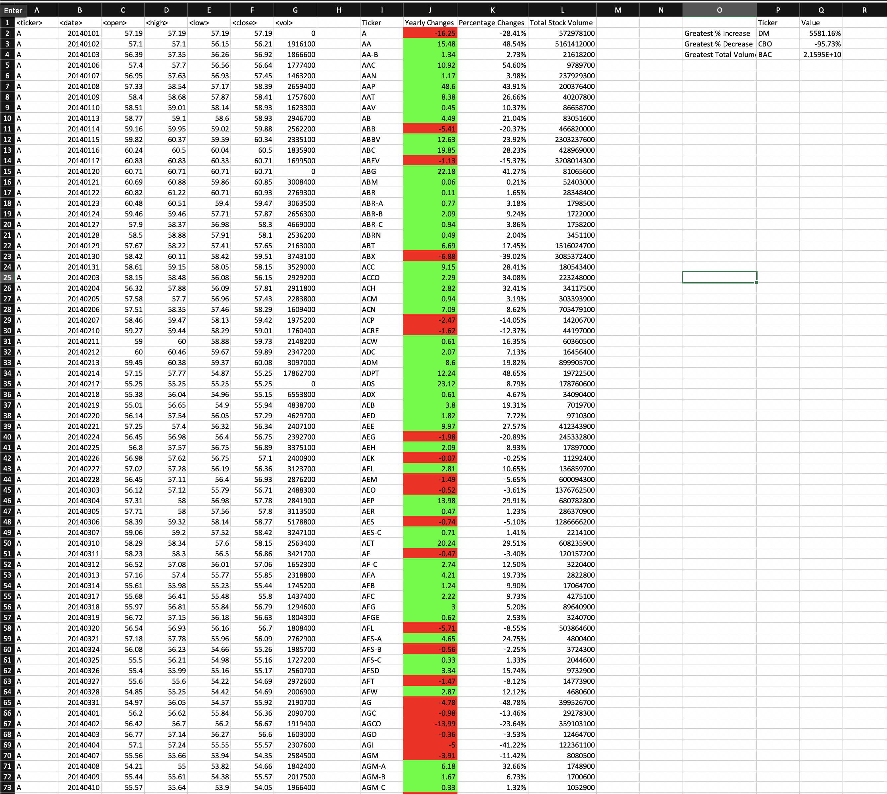
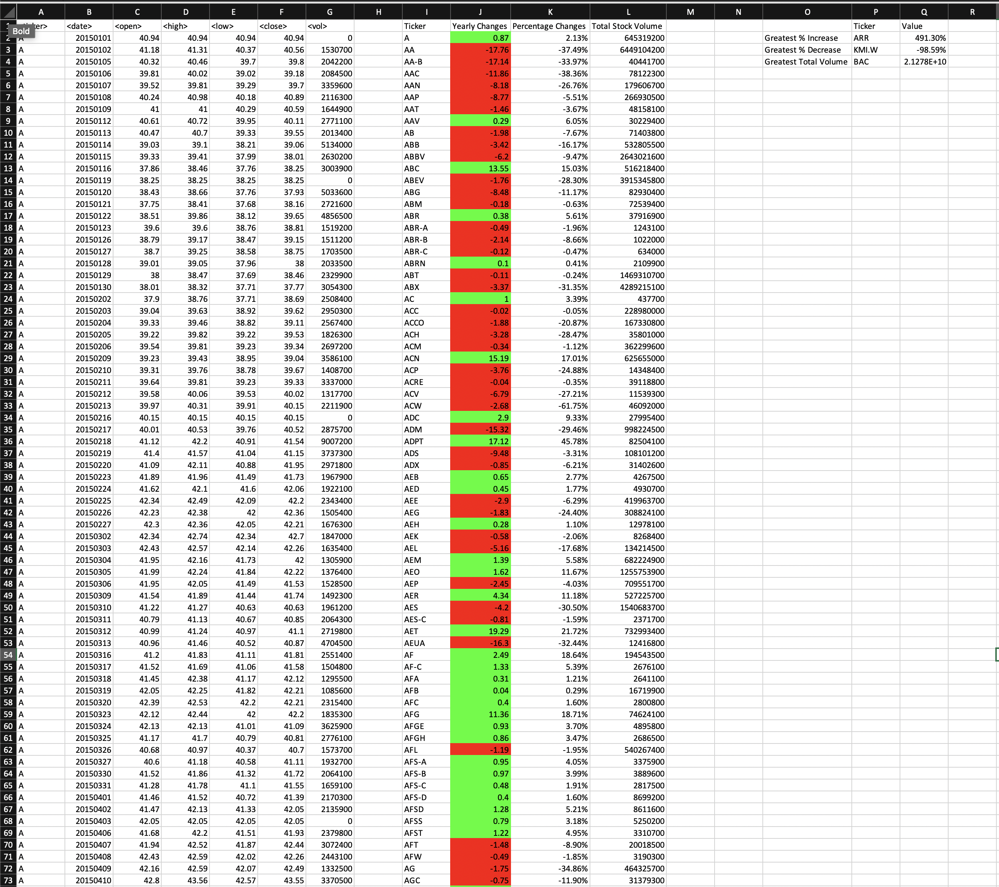
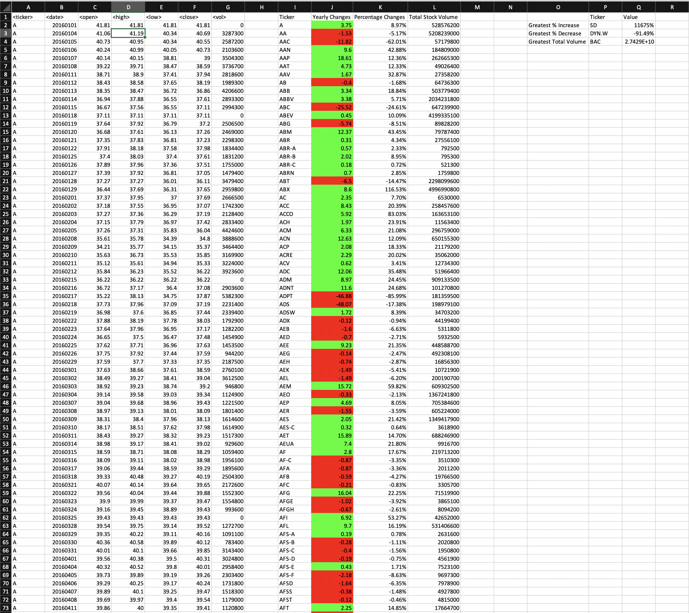

# VBA-challenge
Second homework of Bootcamp Analytics

I included the solved file so you can look at the complete excercise, the following screenshots do not show all results obtained from the vba main script.

## 2014

## 2015

## 2016

